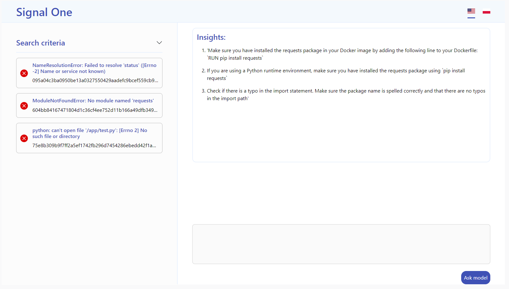

# docker-signalone

> [!WARNING]
> Extension is still work in progress. It is not published as official SignalOne Docker extension yet.

## Overview
Signal0ne docker extension is a tool for debugging and monitoring containerized apps, which enables automated insights about failed containers and containers affected by resource usage anomalies.



## How to install release

```
docker extension install 322456/signalone-extension:latest
```

## How to use locally

### Prerequisites
- Docker with compose
- Make

### Backend

```
make --directory=./backend build-backend
docker-compose -f ./backend/docker-compose.yaml up
```

### Extension
```
make --directory=./ext build-extension
docker extension install 322456/signalone-extension:dev
```

## Reporting issues

Please report issues using "Issues" github repository tab. Do not duplicate issues.

## Contributing
To contribute to this project start by browsing through open issues. If you find any issue you can help with do a fork and create a pull request.

## License
MIT